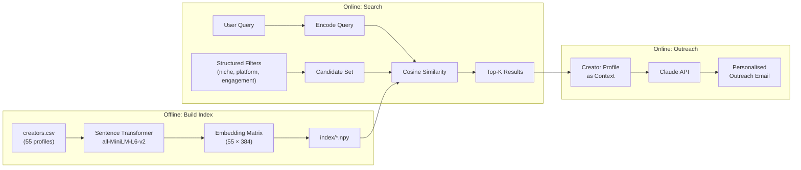

# Creator Outreach RAG 🎯

[](https://www.python.org/downloads/)
[](https://huggingface.co/sentence-transformers/all-MiniLM-L6-v2)
[](https://docs.anthropic.com/)
[](LICENSE)

**Semantic search + AI-powered outreach for influencer marketing.**

I got tired of manually searching through spreadsheets of 500+ creators and writing the same outreach email 50 times with minor tweaks.  This tool uses actual vector embeddings to find the right creators by *meaning* — not just keyword matching — and then generates genuinely personalised outreach emails using their real profile data as context.

---

## The Problem

Every influencer marketing workflow looks the same:

1. Open a massive spreadsheet of creators
2. Ctrl+F for "skincare" and hope for the best
3. Manually compare engagement rates, follower counts, past brand deals
4. Copy-paste a template email and swap out the name
5. Repeat 50 times

The result? Generic outreach that creators ignore, and hours wasted on discovery that still misses great matches because keyword search can't understand that "Korean beauty routine educator" is relevant when you search for "skincare creators who explain ingredients."

## The Solution

This tool replaces keyword search with **semantic vector search** and template emails with **AI-generated personalised outreach**.

## Architecture



### How It Works

1. **Embedding** — Each creator's bio, niche, past brands, and content style are concatenated into a text passage and encoded into a 384-dimensional vector using `all-MiniLM-L6-v2`.

2. **Pre-filtering** — Structured filters (niche, platform, engagement rate, follower range, country) narrow the candidate set *before* vector search, improving both relevance and speed.

3. **Semantic search** — The user's natural-language query is encoded with the same model. Cosine similarity against the candidate embeddings returns the top-K most relevant creators.

4. **Outreach generation** — The matched creator's full profile (past brands, content style, engagement metrics, bio) is injected into a Claude prompt to generate a genuinely personalised email — not a template with `{name}` swapped in.

---

## Quick Start

### 1. Install

```bash
pip install -r requirements.txt
```

### 2. Build the index

```bash
python app.py build-index
```

This encodes all 55 creator profiles into embeddings and saves them to `index/`.

### 3. Search

```bash
# Semantic search — finds creators by meaning, not keywords
python app.py search "beauty creators who break down skincare ingredients" --top-k 5

# Add structured filters
python app.py search "high engagement fitness content" --platform tiktok --min-engagement 9.0

# Combine niche filter with semantic query
python app.py search "healthy meal prep on a budget" --niche food --top-k 5
```

### 4. Generate outreach (requires Anthropic API key)

```bash
# Copy .env.example to .env and add your key
cp .env.example .env

python app.py outreach --creator @glowwithrae --campaign "Summer Glow Serum Launch" --tone casual
python app.py outreach --creator @fitjake_ --campaign "Pre-Workout Launch" --template collaboration --tone formal
```

---

## Example Output

### Search Results

```
🔍  Top 5 results for: "beauty creators who do skincare tutorials"

╭─────────┬──────────────────┬────────────┬──────────┬─────────────┬────────┬───────────╮
│ Score   │ Username         │ Platform   │ Niche    │ Followers   │ Eng %  │ Country   │
├─────────┼──────────────────┼────────────┼──────────┼─────────────┼────────┼───────────┤
│ 0.782   │ @glowwithrae     │ tiktok     │ beauty   │ 487.0K      │ 9.2%   │ US        │
│ 0.741   │ @skincarebysana  │ instagram  │ beauty   │ 412.0K      │ 9.8%   │ CA        │
│ 0.719   │ @dermdoctor_amy  │ instagram  │ beauty   │ 534.0K      │ 6.4%   │ US        │
│ 0.687   │ @asmr_skincare_vi│ tiktok     │ beauty   │ 445.0K      │ 9.5%   │ US        │
│ 0.634   │ @beautymarks_di  │ youtube    │ beauty   │ 756.0K      │ 7.8%   │ US        │
╰─────────┴──────────────────┴────────────┴──────────┴─────────────┴────────┴───────────╯
```

See full examples in [`output/`](output/).

---

## Project Structure

```
creator-outreach-rag/
├── app.py                          # CLI entry point (argparse)
├── src/
│   ├── __init__.py
│   ├── config.py                   # Centralised configuration
│   ├── embeddings.py               # CreatorIndex — vector search with sentence-transformers
│   ├── filters.py                  # FilterEngine — chainable structured pre-filters
│   └── outreach.py                 # OutreachGenerator — Claude API email generation
├── data/
│   └── creators.csv                # 55 realistic creator profiles
├── index/                          # Pre-built .npy embedding files
├── output/
│   ├── example_search_results.md   # Example search output
│   └── example_outreach_email.md   # Example generated email
├── tests/
│   ├── test_filters.py             # FilterEngine unit tests
│   └── test_embeddings.py          # CreatorIndex unit tests
├── requirements.txt
├── Makefile
├── .env.example
├── .gitignore
└── README.md
```

## CLI Reference

| Command | Description |
|---------|-------------|
| `python app.py build-index` | Encode creator profiles and save embeddings |
| `python app.py search "<query>"` | Semantic search with optional filters |
| `python app.py outreach --creator @handle --campaign "..."` | Generate personalised email |

### Search Flags

| Flag | Description |
|------|-------------|
| `--top-k N` | Number of results (default: 5) |
| `--niche` | Filter by niche (beauty, fitness, food, tech, fashion, lifestyle) |
| `--platform` | Filter by platform (tiktok, instagram, youtube, twitch) |
| `--country` | Filter by country code (US, UK, CA, IN, JP) |
| `--min-engagement` | Minimum engagement rate (%) |
| `--min-followers` | Minimum follower count |
| `--max-followers` | Maximum follower count |

### Outreach Flags

| Flag | Description |
|------|-------------|
| `--tone` | Email tone: formal, casual, friendly (default: friendly) |
| `--template` | Template: affiliate, collaboration, follow_up (default: affiliate) |
| `--previous-date` | Date of prior outreach (for follow_up template) |

---

## Running Tests

```bash
pytest tests/ -v
```

---

## Tech Stack

| Component | Technology | Why |
|-----------|-----------|-----|
| Embeddings | `sentence-transformers` (all-MiniLM-L6-v2) | Fast, high-quality semantic embeddings. 384-dim vectors keep the index small. |
| Vector search | NumPy cosine similarity | No external vector DB needed — 55 creators × 384 dims fits in memory trivially. |
| LLM | Claude API (Anthropic) | Strong instruction-following for personalised email generation. |
| Data | Pandas + CSV | Simple, portable, easy to inspect and extend. |
| CLI | argparse | Zero dependencies, ships with Python. |

## Future Improvements

- **Hybrid search** — Combine vector similarity with BM25 keyword scores for better recall.
- **CRM integration** — Auto-log outreach emails to HubSpot and track response rates.
- **Batch outreach** — Generate emails for all top-K results in one command.
- **Web UI** — Streamlit or Gradio frontend for non-technical team members.
- **Auto-refresh embeddings** — Watch the CSV for changes and rebuild incrementally.
